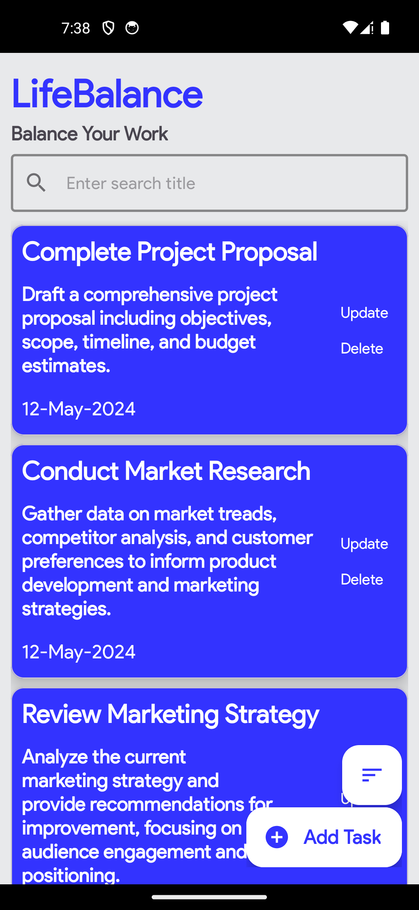
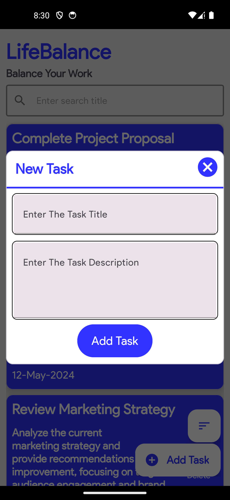
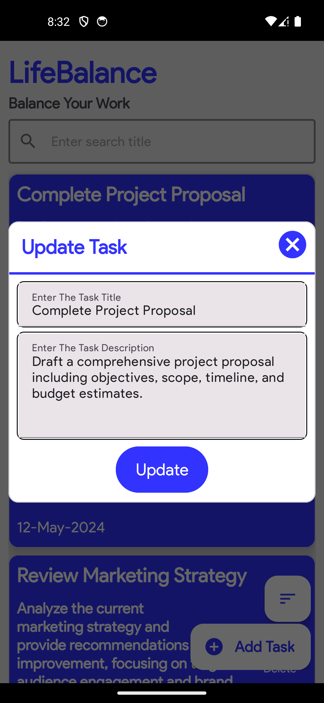

# LifeBalance Task Management App

LifeBalance is a task management application designed to help users organize their daily tasks and activities, leading to a more balanced and productive lifestyle.

## Features

- **Task Creation**: Easily add new tasks to your list with details such as title, description, due date.
- **Task Update**: Update existing tasks to modify details, adjust due dates.
- **Task Deletion**: Delete tasks that are no longer relevant or necessary to keep your task list clean and organized.

## Getting Started

To get started with LifeBalance, follow these steps:

1. **Clone the Repository**: Clone this repository to your local machine using the following command: https://github.com/Tommy14/Task_Management.git

2. **Open in Android Studio**: Open the project in Android Studio.

3. **Build and Run**: Build and run the project on your Android device or emulator.

## Screenshots

    
    
    
    

